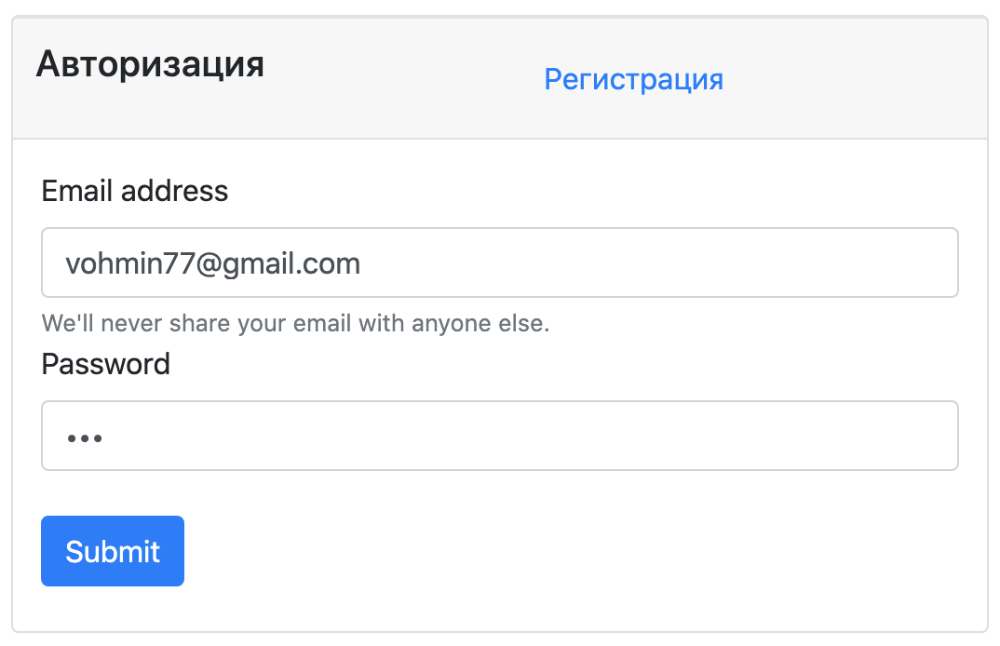
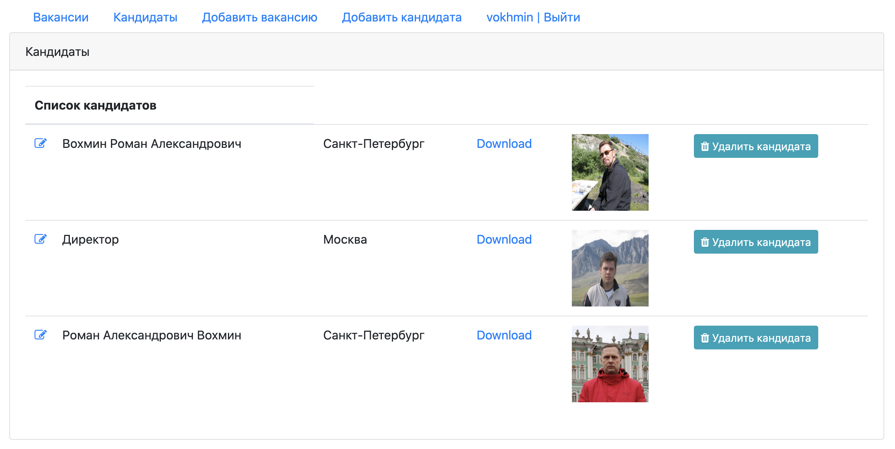
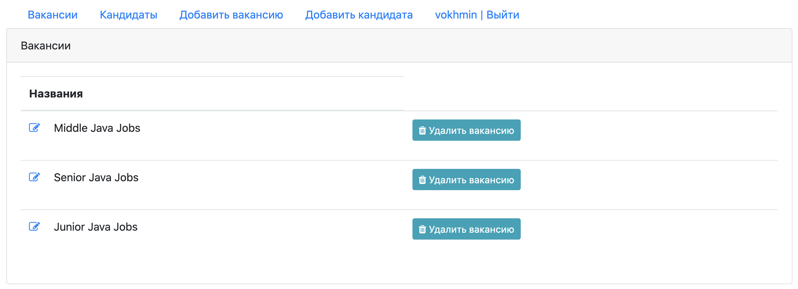
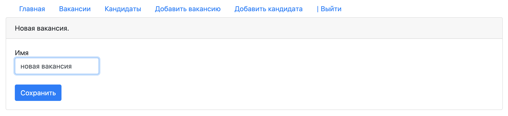

# проект "Работа мечты"

Web-приложение учета имеющихся вакансий и кандидатов на них.
Разработано в качестве итоговой работы изучения сервлетов java с использованием шаблона __MVC__.

В качестве хранилища используется база данных __PostgreSQL__, сборщик проекта - __Maven__, модульное тестирование сервлетов Mockito.
Отображение страниц - __JSP, Servlets__. В JSP используется библиотека тегов __JSTL__, готовые HTML шаблоны
__BootStrap4__. Протокол HTTP. Проверка на пустое поле выполнена при помощи __AJAX__

В приложении реализована регистрация и аутентификация пользователей приложения (Filter, Session, Auth), на все страницы могут войти только 
авторизованные пользователи. На каждой странице авторизованного пользователя отображается его имя, ссылка для выхода.

* Страница __"Кандидаты"__ - отображение списка кадидатов и их фотографий, города. Слева от имени кандидата иконка, ведущая на 
страницу редактирования данных кандидата (ФИО и города). Справа от фотографии - кнопка удаления кандидата из базы. Слева от 
фотографии ссылка для её скачивания.

* Страница __"Вакансии"__ - отображение списка имеющихся в БД вакансий, справа от каждой вакансии кнопка для её удаленияб
слева - редактирование вакансии.

* Страница __"Добавить вакансию"__.

* Страница __"Добавить кандидата"__ - перенапрявляет на страницу загрузки фотографии кандидата (выбирается из имеющихся 
в файловой системе пользователя). Для выбора фото кандидата нажать на кнопку "Upload", затем
пользователь перенаправляется на страницу ввода имени кандидата, после чего кандидат заносится в БД

 

